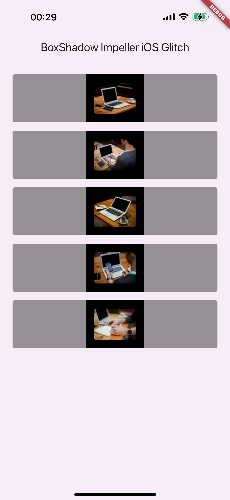

# boxshadow_glitch

A glitch I have observed using Impeller on a physical iPhone running iOS 18.2.1.

This does not occur on an iOS simulator running iOS 18.2.

| Flutter 3.24.5 ✅                | Flutter 3.27.3 ❌                | Flutter master ❌                |
|---------------------------------|---------------------------------|---------------------------------|
|  |  |  |
